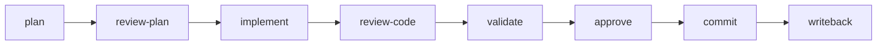
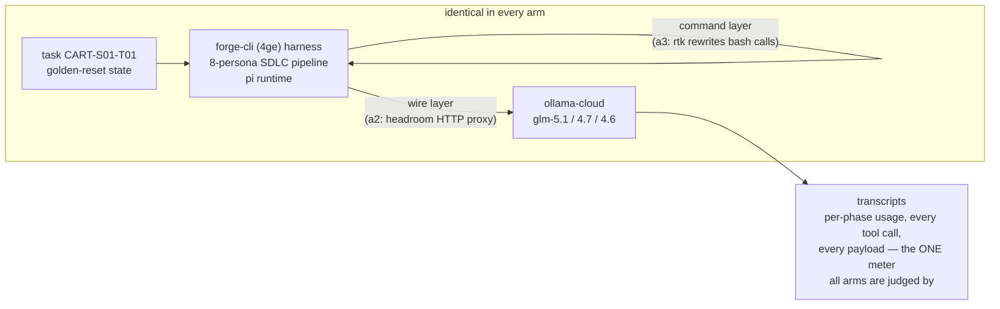

# tokbench — an independent eval of token-saving middleware for coding agents

**Question:** do context-management middlewares —
[lean-ctx](https://github.com/yvgude/lean-ctx) (tool-level context runtime),
[rtk](https://github.com/rtk-ai/rtk) (command-level output rewriter),
[headroom](https://github.com/chopratejas/headroom) (wire-level compression proxy) —
actually reduce what the provider bills you for, on a real long-running agentic
software engineering workload — and at what cost?

**Answer (pilot, N=1 per arm — replication runs in progress, see [PROTOCOL](bench/PROTOCOL.md)):**

```text
Provider-billed input tokens — same task, same harness, same models

native (none)           ██████████████████████              2.28M
rtk 0.42                ████████████████████████████        2.89M   +27%
lean-ctx 3.7 (MCP)      ██████████████████████████████      3.14M   +38%
headroom 0.23           ███████████████████████████████     3.24M   +43%*
lean-ctx 3.7 (default)  ███████████████████████████████████ 3.62M   +59%

* headroom's wire counterfactual: it removed 342K tokens the run would
  otherwise have billed (−9.5%) — the only genuine saving measured.
  The +43% headline is run-path variance, not the proxy. See below.
```

```text
Latency — seconds of model time per request turn

native (none)           ███████████                         2.8
headroom 0.23           ███████████████                     3.7
rtk 0.42                █████████████████                   4.2
lean-ctx 3.7 (MCP)      █████████████████                   4.2
lean-ctx 3.7 (default)  ███████████████████████████         6.8
```

### The three meters never agree — that's the finding

| Arm | Vendor's benchmark claim | Product's own meter, this run | What the provider billed |
|---|---|---|---|
| **rtk** | 60–90% savings | 58.4K saved (74.7% *of commands it touched*) | touched slice ≈ **2.5% of total spend** |
| **headroom** | 47–92% (benchmarks) / 4.8% (their fleet median) | 342K removed, **10.2% avg** — only genuine on-wire saving measured | billed total still within noise of native |
| **lean-ctx** | "60–99% compression, ~13-token re-reads" | **"0 tokens saved · 0.0% · $-0.001"** (its own dashboard) | +38% vs native (best config) |

Every product passed its engage-check. Every run completed its task with all
quality gates green. The differences are architecture and addressable surface —
not whether the products "work."

---

## How we tested — and why this is representative

**The workload is real software engineering, not a synthetic benchmark.**

The task — `CART-S01-T01` — is an actual bug in *cartographer*, a small TypeScript
CLI (commander + lowdb): its `save()` used `await import("fs")` inside a synchronous
function, a TS1308 compile error that meant `mkdirSync` never ran — first write on a
fresh machine would fail. The agent has to diagnose it, fix the import, keep `save()`
synchronous, prove it with the regression test, and leave build/test/lint green plus
the project docs updated. Small, sharp, and exactly the shape of a thousand daily
engineering tickets — not a LeetCode puzzle, not a 10-file refactor staged for demo
effect.

One command — `/forge:run-task CART-S01-T01` — drives the full
[forge-cli (4ge)](https://4ge.sh) SDLC pipeline around that fix:



Eight phases, each executed by a different **persona** (architect, supervisor,
engineer, QA…) on its own model tier (glm-5.1 / 4.7 / 4.6). Reviews gate
progression — a plan must survive review before implementation starts; code must
survive review before validation; validation runs the real gates. The pipeline
ends in an actual git commit and a knowledge-base writeback. One run ≈ 180–240
model turns, ~2.2–3.6M billed input tokens, 13–27 minutes of model time. This is
**long-running agentic orchestration** — the dominant real-world context-cost
regime, where every turn re-pays its accumulated context.

**Everything is held constant except the middleware:**

| Held constant | How |
|---|---|
| The problem | one task (`CART-S01-T01`, a real bug-fix), byte-identical starting state via checksummed golden reset |
| The provider & models | ollama-cloud; identical persona→model map (glm-5.1 / 4.7 / 4.6) baked into every image |
| The harness | forge-cli 1.0.21 on pi-coding-agent 0.78, identical pinned image base |
| The time window | all pilot arms ran within one ~2.5-hour window (provider conditions comparable); replication interleaves arms to control drift |
| The operator | same person, scripted observe-only protocol, every prompt answered with documented defaults |

**The only variables:** the context-management middleware (none / tool-level /
command-level / wire-level) — and run-to-run stochasticity, which we measure
instead of ignoring (native baseline ×5 in replication; pilot already shows
total-level reproducibility within 1.3% across image bases, while individual
phases swing ±50% — single-run benchmarks cannot detect sub-5% effects).



**One neutral meter.** Every number comes from the provider-reported usage in the
harness transcripts (`results/*/transcripts/`) — never from the products' own
analytics, which we capture separately and audit against the bill.

## Why this harness is a fair — and demanding — test

forge-cli practices **context governance as architecture**, and we publish that
rather than hide it (it is also the author's own product — see
[Conflicts](#conflicts--scope)). What that means concretely:

- **Every phase is context-isolated.** The implement agent never sees the
  planner's 35-turn exploration — it sees the *plan*. Each of the 8 phases starts
  a fresh agent with a fresh context (final contexts run only 13–24K tokens);
  nothing accumulates across phase boundaries. Cross-phase handoff happens
  through reviewed **artifacts** (PLAN.md, review verdicts, validation reports),
  not through a shared ever-growing transcript. Phase isolation is the single
  most effective context optimization in this entire benchmark — and the harness
  does it natively, for free.
- **State i/o goes through governed tools.** Knowledge-base reads, store
  transitions, and artifact passing use forge's own compact, schema-validated
  tools (`forge_store`, `forge_artifact`) — traffic middleware cannot see, and
  which is already near-minimal by construction.
- **Persona-scoped context.** Each phase's agent gets the knowledge-base slice
  its role needs, on the model tier its role warrants — not the whole project
  dumped into every prompt.
- **But the normal, token-hungry work remains.** Inside each phase the agent
  still reads real source files, runs `git`, `npm test`, eslint, and explores
  with the shell — measured at **~26% of context** in the native baseline.
  That slice is precisely what these middlewares exist to compress.

This is what makes the test demanding *and* fair: the middlewares aren't
competing against naive context accumulation — they're competing against a
harness that already governs its context, on the residual surface every real
harness still has. A product that earns its keep here earns it anywhere; a
product that only shines on a wasteful harness is solving the harness's
problem, not yours.

## Reproduce it

```bash
git clone <this-repo> && cd tokbench/bench/docker/base
docker build -t tokbench-base:1.0 .            # fully scripted, no secrets
docker run -it -e OLLAMA_API_KEY=<yours> tokbench-base:1.0
# inside: /forge:run-task CART-S01-T01  — that's the native arm, end to end
```

Arm images build the same way (`bench/docker/arm-*/`). Every binary is
vendored and sha256-pinned; versions in [`bench/pins.env`](bench/pins.env).
Full pre-registered replication protocol: [`bench/PROTOCOL.md`](bench/PROTOCOL.md).

### Watch any published run

Every run's transcripts are in `results/` — render them in forge's own viewer:

```bash
docker run -it --rm \
  -v $PWD/results/a0-T-fix-r1/transcripts:/home/bench/forge-testbench/cartographer/.forge/transcripts \
  --entrypoint bash tokbench-base:1.0
# inside:  cd ~/forge-testbench/cartographer && forge   → open the transcript viewer
```

No pre-rendered recordings needed — the data *is* the footage.

## Conflicts & scope

The harness (forge-cli/4ge) and the testbench project are the author's products;
the author is a daily lean-ctx user. Findings are scoped to this harness, this
provider (request-metered, no prompt-cache discounts), one small TypeScript
codebase, and interactive operation. We do **not** claim these products fail in
general — we claim that on a context-frugal harness the addressable surface, not
the compression ratio, decides the outcome, and that as-shipped integration
defaults materially change results (full mechanism analysis in
[`notes/`](notes/)).

## Repo map

| Path | Contents |
|---|---|
| `bench/` | Dockerfiles, compose, runner/harvest scripts, pins, frozen protocol |
| `results/` | raw per-run transcripts (primary data), summaries, manifests, product self-metrics, quota logs |
| `notes/` | lab notebook: infrastructure, run analyses, per-product integration findings, publication checklist |
| `casts/` | asciinema recordings of runs (replayed from preserved containers) |
