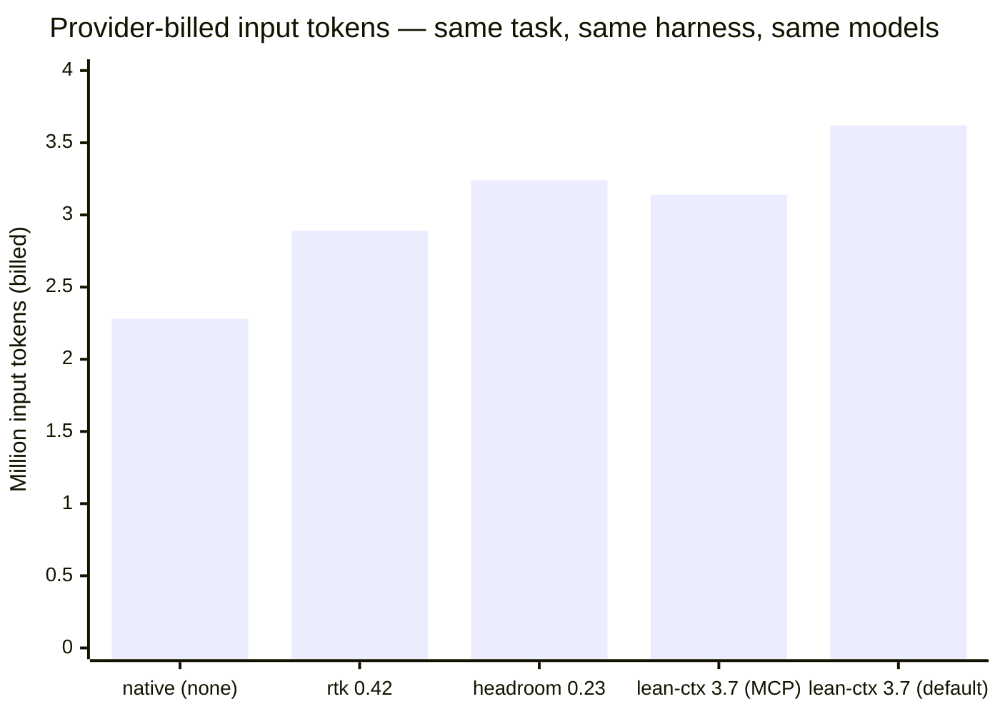
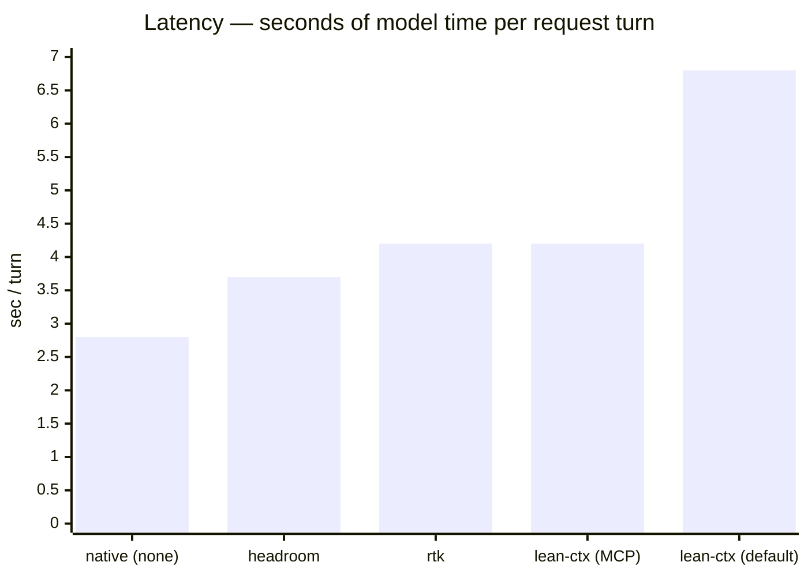
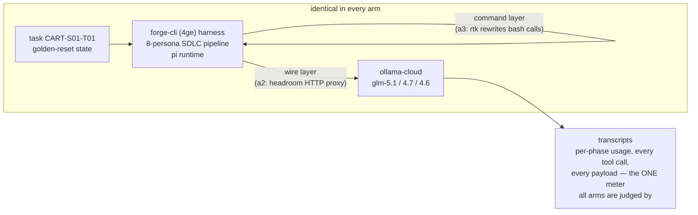

# tokbench — an independent eval of token-saving middleware for coding agents

**Question:** do context-management middlewares (lean-ctx, rtk, headroom) actually
reduce what the provider bills you for, on a real long-running agentic software
engineering workload — and at what cost?

**Answer (pilot, N=1 per arm — replication runs in progress, see [PROTOCOL](bench/PROTOCOL.md)):**





### The three meters never agree — that's the finding

| Arm | Vendor's benchmark claim | Product's own meter, this run | What the provider billed |
|---|---|---|---|
| **rtk** | 60–90% savings | 58.4K saved (74.7% *of commands it touched*) | touched slice ≈ **2.5% of total spend** |
| **headroom** | 47–92% (benchmarks) / 4.8% (their fleet median) | 342K removed, **10.2% avg** — only genuine on-wire saving measured | billed total still within noise of native |
| **lean-ctx** | "60–99% compression, ~13-token re-reads" | **"0 tokens saved · 0.0% · $-0.001"** (its own dashboard) | +38% vs native (best config) |

Every product passed its engage-check. Every run completed its task with all
quality gates green. The differences are architecture and addressable surface —
not whether the products "work."

---

## How we tested — and why this is representative

**The workload is real software engineering, not a synthetic benchmark.**
Each run drives a full SDLC pipeline on [forge-cli (4ge)](https://4ge.sh):
plan → review-plan → implement → review-code → validate → approve → commit →
writeback — 8 agent personas, ~180–240 model turns, ~2.2–3.6M input tokens,
objective pass/fail gates (build, tests, lint, acceptance criteria). This is
**long-running agentic orchestration**: the dominant real-world context-cost
regime, where every turn re-pays the accumulated context.

**Everything is held constant except the middleware:**

| Held constant | How |
|---|---|
| The problem | one task (`CART-S01-T01`, a real bug-fix), byte-identical starting state via checksummed golden reset |
| The provider & models | ollama-cloud; identical persona→model map (glm-5.1 / 4.7 / 4.6) baked into every image |
| The harness | forge-cli 1.0.21 on pi-coding-agent 0.78, identical pinned image base |
| The time window | all pilot arms ran within one ~2.5-hour window (provider conditions comparable); replication interleaves arms to control drift |
| The operator | same person, scripted observe-only protocol, every prompt answered with documented defaults |

**The only variables:** the context-management middleware (none / tool-level /
command-level / wire-level) — and run-to-run stochasticity, which we measure
instead of ignoring (native baseline ×5 in replication; pilot already shows
total-level reproducibility within 1.3% across image bases, while individual
phases swing ±50% — single-run benchmarks cannot detect sub-5% effects).



**One neutral meter.** Every number comes from the provider-reported usage in the
harness transcripts (`results/*/transcripts/`) — never from the products' own
analytics, which we capture separately and audit against the bill.

## Why this harness is a fair — and demanding — test

forge-cli is itself context-frugal by design, and we publish that rather than
hide it (it is also the author's own product — see [Conflicts](#conflicts--scope)):

- **Custom i/o tools:** forge routes its knowledge-base and state operations
  through its own compact tools (`forge_store`, `forge_artifact`) — middleware
  cannot see that traffic, and it is already small.
- **Internal compression:** the harness ships its own output-compression layer
  and a minimalist pi runtime (sub-1K system prompt philosophy).
- **But it still does the normal, token-hungry things:** raw source reads, `git`,
  `npm test`, lint runs, shell exploration — measured at **~26% of context** in
  the native baseline. That slice is exactly what these middlewares exist to
  compress. A product that earns its keep here earns it anywhere; a product that
  only shines on a wasteful harness is solving the harness's problem, not yours.

## Reproduce it

```bash
git clone <this-repo> && cd tokbench/bench/docker/base-1.0
docker build -t tokbench-base:1.0 .            # fully scripted, no secrets
docker run -it -e OLLAMA_API_KEY=<yours> tokbench-base:1.0
# inside: /forge:run-task CART-S01-T01  — that's the native arm, end to end
```

Arm images build the same way (`bench/docker/arm-*-1.0/`). Every binary is
vendored and sha256-pinned; versions in [`bench/pins.env`](bench/pins.env).
Full pre-registered replication protocol: [`bench/PROTOCOL.md`](bench/PROTOCOL.md).

## Conflicts & scope

The harness (forge-cli/4ge) and the testbench project are the author's products;
the author is a daily lean-ctx user. Findings are scoped to this harness, this
provider (request-metered, no prompt-cache discounts), one small TypeScript
codebase, and interactive operation. We do **not** claim these products fail in
general — we claim that on a context-frugal harness the addressable surface, not
the compression ratio, decides the outcome, and that as-shipped integration
defaults materially change results (full mechanism analysis in
[`notes/`](notes/)).

## Repo map

| Path | Contents |
|---|---|
| `bench/` | Dockerfiles, compose, runner/harvest scripts, pins, frozen protocol |
| `results/` | raw per-run transcripts (primary data), summaries, manifests, product self-metrics, quota logs |
| `notes/` | lab notebook: infrastructure, run analyses, per-product integration findings, publication checklist |
| `casts/` | asciinema recordings of runs (replayed from preserved containers) |
