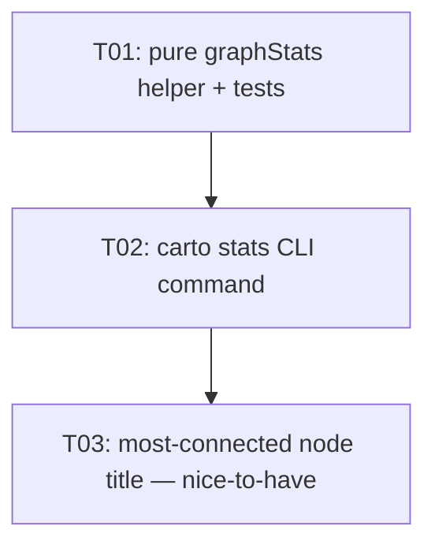

# Sprint Manifest — CART-S02: Add carto stats command

**Sprint:** CART-S02
**Execution Mode:** sequential

---

## Goals

`carto` exposes a read-only `stats` command that prints the node and edge counts
of the stored graph (`~/.cartographer/graph.json`). Counting is backed by a new
**pure** `graphStats(graph)` helper in `src/store/graph.ts`; all presentation
(pluralisation, colour) stays in `src/cli.ts`. This is a deliberately tiny
throwaway sprint that exercises the plan → implement → review → commit pipeline
end to end.

Observable outcome: running `carto stats` against a graph with 2 nodes and 1 edge
prints `2 nodes, 1 edge`.

## Tasks

| Task ID | Title | Estimate | Depends On | Pipeline | Status |
|---|---|---|---|---|---|
| CART-S02-T01 | Add pure `graphStats` helper + unit tests | S | — | default | planning |
| CART-S02-T02 | Add read-only `carto stats` CLI command | S | T01 | default | planning |
| CART-S02-T03 | *(nice-to-have)* most-connected node title in `stats` | S | T02 | default | planning |

Scope is set against the entity model — **Graph** (the `~/.cartographer/graph.json`
container), **Node** (idea/concept, looked up by `title`), and **Edge** (directed
relationship by `Node.id`). T01 owns the pure counting layer in `graph.ts`; T02
owns the I/O/presentation layer in `cli.ts`; T03 (optional) extends both with a
degree computation.

## Dependency Graph

**Critical path:** T01 → T02 (→ T03 if pursued). The chain is fully linear:
every downstream task depends on the prior task's signature/command, so there is
no parallelism to exploit — hence **sequential** execution.

## Operational Impact

| Category | Impact |
|---|---|
| Persistence schema | None — `Graph` / `Node` / `Edge` shapes and `~/.cartographer/graph.json` format are untouched (read-only command). |
| CLI surface | New read-only `carto stats` command. No new flags or options. |
| Offline-only invariant | Preserved — no database or network dependency; Node built-ins only. |
| Migration | None — no schema or persistence change; existing graph files work unchanged. |
| Build / test | `npm run build` · `npm test` (vitest) · `npm run lint` — all must exit 0 per task. |

### Operational-impact risk categories

- **data-corruption** — none: `stats` is read-only and never calls `save()`.
- **cli-ux** — primary surface: pluralisation must be correct and independent for
  both counts (`2 nodes, 1 edge`; `1 node, 0 edges`; `0 nodes, 0 edges`).
- **build-failure** — low: additive pure function + additive command, caught by
  the `build` gate.
- **test-coverage** — `graphStats` (and, for T03, the degree helper) are pure and
  unit-tested directly with in-memory fixtures (no `fs`/`crypto` mocking needed).

## Technical Debt

No debt repayment scheduled. The pre-existing roadmap items (fuzzy/id node lookup,
duplicate-title handling, unused `lowdb`/`enquirer` deps) are explicitly out of
scope and untouched.

## Carry-Over

None — CART-S01 (the `save()` import fix) completed with no outstanding items.

## Risks

| Risk | Likelihood | Mitigation |
|---|---|---|
| Pluralisation logic adds avoidable complexity | Low | Keep `graphStats` count-only (pure); inline two independent singular/plural ternaries in `cli.ts`. |
| Pure/I-O seam violated (counting or console placed on the wrong side) | Low | T01 keeps `graphStats` free of `console`/`load`; T02 owns all I/O and formatting in `cli.ts`. |
| T03 edge cases (ties, empty graph, id→title) mishandled | Low | T03 is gated behind the must-haves; tie-break is first-encountered, empty/no-edges returns a defined sentinel, all covered by unit tests. |
